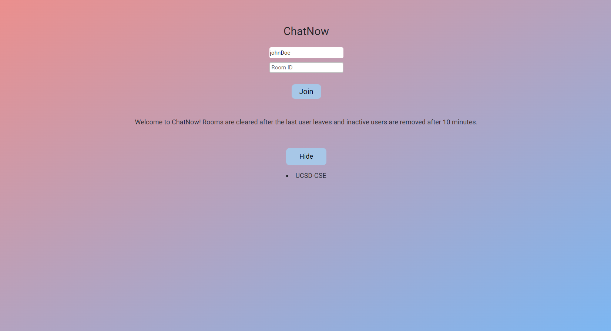
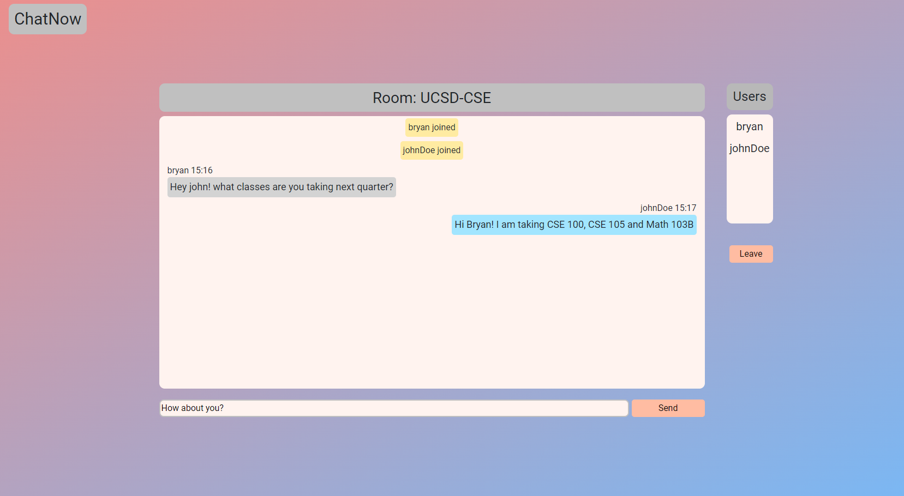

# ChatNow

ChatNow is an application that allows group conversations to happen in real time. Users can create or join existing rooms based on a room-id that represents a topic or a passphrase shared among some users. In addition, the login page allows users to find existing rooms to join if they wished to. Note that users will be deleted from database if they are inactive for 10 minutes and messages in a room will be deleted if all the users leave.

## Visuals




## Installation and Running

1. clone the projet
```
git clone git@github.com:bchoUCSD/ChatApp.git
```


3. Open two terminals 
```
// terminal 1
cd client
npm install
npm start

// terminal 2
cd server
npm install
npm start
```

## Roadmap
- Account creation and private messaging between users with persistant data
